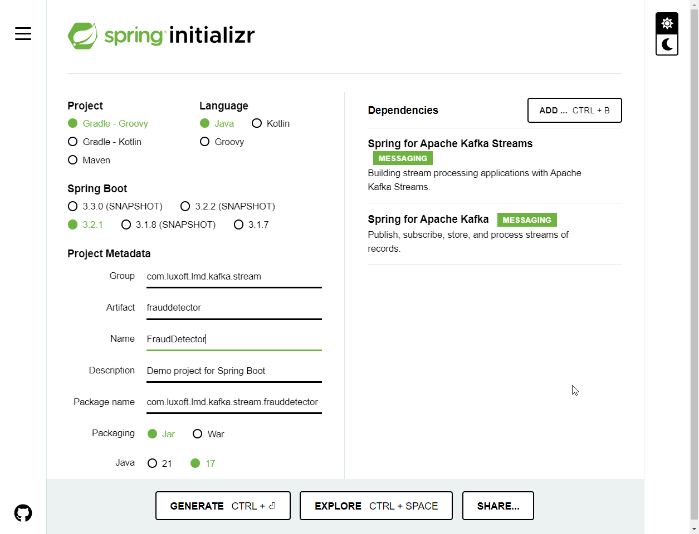

= Kafka Streams coding task
:source-highlighter: highlight.js
:icons: font
:tabsize: 2

== Prerequisites

1. You have a Kafka topic `credit-card-transactions` with 12 partitions.
1. The topic contains following records with following specifics:

* no keys
* record timestamp is wall clock
* AVRO based payload:
+
[cols="1,1"]
|===
| Name| Type

| transactionId
| string

| dateTime
| timestamp

| customerId
| string

| creditCardNumber
| string

| creditCardExpiry
| string

| status
| enum [REJECTED,CONFIRMED]

| value
| double

|===

== Requirements

We need to protect credit card holders from unauthorized use (i.e. theft).

If during 10 minutes we detect at least 5 rejected transactions issues with the same credit card - the credit card should be blocked

Locking request should be directed to 'credit-card-lock' topic with following semantics:

* 3 partitions
* key -> creditCardNumber
* payload -> AVRO:
+
|===
| Name | Type | Comment

| creditCardNumber
| string
|

| dateTime
| timestamp
| The moment of detection from wallclock

| failedTransactionCount
| long
| Number of detected fraudulent transaction
|===

Build the solution using Kafka Streams

* start from scratch so you understand how to build a standalone project
* create a test data generator
* build your topology
* make sure the topology is safe for future modifications.
* visualize your topology
* make sure you assure `exactly-once` delivery mode.

== Detailed solution guide

=== Project preparation

1. Go to https://start.spring.io/[] and generate a project:
+
* Enter sensible project metadata
* add `Spring for Kafka` dependency
* add `Spring for Apache Kafka Streams` dependency
+

1. Unpack the project and open it in IntelliJ IDEA

* setup project's JDK in `File | Project Structure`
+

* setup JDK for gradle build in `File | Settings`
+

* make sure Gradle model loaded, if not - refresh it
+

* build your app
+

+
A faster ways is to press `Ctrl, Ctrl`:
+

1. We need some additional dependencies and plugins to enable AVRO development
+
[source,groove]
.build.gradle - add gradle plugin for AVRO
----
plugins {
	id 'java'
	id 'org.springframework.boot' version '3.2.1'
	id 'io.spring.dependency-management' version '1.1.4'

	id "com.github.davidmc24.gradle.plugin.avro" version '1.5.0' // ++
}
----
+
[source,groovy]
.build.gradle - add `packages.confluent.io` maven repository
----
repositories {
    mavenCentral()
    maven { // ++
        url = uri("https://packages.confluent.io/maven/")
    }
}
----
+
[source,groovy]
.build.gradle - add AVRO Serde dependency
----
dependencies {
	implementation 'org.springframework.boot:spring-boot-starter'
	implementation 'org.springframework.kafka:spring-kafka'
	implementation 'org.apache.kafka:kafka-streams'
	implementation 'io.confluent:kafka-streams-avro-serde:7.4.2' // ++

	testImplementation 'org.springframework.boot:spring-boot-starter-test'
	testImplementation 'org.springframework.kafka:spring-kafka-test'
}
----

1. Refresh Gradle model and rebuild your app

1. You are ready to start coding

=== Kafka integration

1. Annotate your application class with `@EnableKafka`
+
[source,java]
.FraudDetectorApplication.java
----
@EnableKafka
@SpringBootApplication
public class FraudDetectorApplication {
	public static void main(String[] args) {
		SpringApplication.run(FraudDetectorApplication.class, args);
	}
}
----

1. Create `src/main/resources/application.yml`
+
* `spring.application.name` should point to some sensible app name. This name will also be used by Kafka Streams
* `spring.kafka.bootstrap-servers` should specify at least one Kafka broker
* `spring.kafka.producer.[key-serializer|value-serializer]` should be set up

+
[source,yaml]
.application.yml
----
spring:
  application:
    name: fraud-detector

  kafka:
    bootstrap-servers:
      - localhost:9092
      - localhost:9093
      - localhost:9094
    producer:
      key-serializer: org.apache.kafka.common.serialization.StringSerializer
      value-serializer: io.confluent.kafka.serializers.KafkaAvroSerializer
----

=== Data generation

1. Declare input topic
+
[source,java]
.FraudDetectorApplication.java
----
@Bean public NewTopic creditCardTransactionsTopic() {
	return TopicBuilder.name("credit-card-transactions").partitions(12).build();
}
----

1. Declare AVRO data model for credit card transaction
+
[source,json]
.src/main/avro/credit-card-transaction.avsc
----
{
  "type": "record",
  "namespace": "com.luxoft.lmd.kafka.stream.frauddetector",
  "name": "CreditCardTransaction",
  "fields": [
    {
      "name": "transactionId",
      "type": "string"
    },
    {
      "name": "dateTime",
      "type": {
        "type": "long",
        "logicalType": "local-timestamp-millis"
      }
    },
    {
      "name": "customerId",
      "type": "string"
    },
    {
      "name": "creditCardNumber",
      "type": "string"
    },
    {
      "name": "creditCardExpiry",
      "type": "string"
    },
    {
      "name": "status",
      "type": {
        "type": "enum",
        "name": "TransactionStatus",
        "symbols": [ "ACCEPTED", "REJECTED" ]
      }
    },
    {
      "name": "value",
      "type": "double"
    }
  ]
}
----

1. Invoke `gradle generateAvroJava` and check if proper transfer object classes have been created.
+

1. Add SchemaRegistry URL to app's configuration.
+
Use `spring.kafka.properties[schema.registry.url]`:
+
[source,yaml]
.application.yml
----
spring:
  application:
    name: fraud-detector

  kafka:
    bootstrap-servers:
      - localhost:9092
      - localhost:9093
      - localhost:9094
    properties:
      schema.registry.url: http://localhost:8085
    producer:
      key-serializer: org.apache.kafka.common.serialization.StringSerializer
      value-serializer: io.confluent.kafka.serializers.KafkaAvroSerializer
----

1. Implement code that generates fake credit card transactions.
+
Add datafaker library to dependencies (do not forget to refresh Gradle model)
+
[source,groovy]
.build.gradle
----
dependencies {
	implementation 'org.springframework.boot:spring-boot-starter'
	implementation 'org.springframework.kafka:spring-kafka'
	implementation 'org.apache.kafka:kafka-streams'
	implementation 'io.confluent:kafka-streams-avro-serde:7.4.2'
	implementation 'net.datafaker:datafaker:2.0.2' // ++

	testImplementation 'org.springframework.boot:spring-boot-starter-test'
	testImplementation 'org.springframework.kafka:spring-kafka-test'
}
----
+
Here is the example of such generator. Feel free to implement any other (i.e. generate data with ChatGPT and import it from file)
+
[source,java]
----
@Component
public class CreditCardTransactionGenerator {
	private final KafkaTemplate<Object, Object> kafkaTemplate;
	private Faker faker = new Faker();
	private Random random = new Random();

	private List<CustomerInfo> customers;

	public record CustomerInfo(String id, String creditCardId, String cardExpiry) {

	}

	public CreditCardTransactionGenerator(KafkaTemplate<Object, Object> kafkaTemplate) {
		this.kafkaTemplate = kafkaTemplate;
		this.customers = generateCustomers();
	}

	private List<CustomerInfo> generateCustomers() {
		return Stream
			.generate(
				() -> new CustomerInfo(
					faker.idNumber().valid(),
					faker.business().creditCardNumber(),
					faker.business().creditCardExpiry()
				)
			)
			.limit(50)
			.collect(Collectors.toList());
	}

	@Scheduled(fixedDelay = 200)
	public void generate() {
		var customer = customers.get(random.nextInt(customers.size()));

		CreditCardTransaction transaction =
			CreditCardTransaction.newBuilder()
				.setTransactionId(UUID.randomUUID().toString())
				.setCustomerId(customer.id)
				.setCreditCardNumber(customer.creditCardId())
				.setCreditCardExpiry(customer.cardExpiry())
				.setDateTime(LocalDateTime.now())
				.setStatus(random.nextBoolean() ? TransactionStatus.ACCEPTED : TransactionStatus.REJECTED)
				.setValue(faker.number().randomDouble(2, 100, 500))
				.build();

		kafkaTemplate.send("credit-card-transactions", null, transaction);
	}
}
----

+
NOTE: Feel free to adjust the message rate, number of customers or failed transaction rate to get good testing results.

+
WARNING: Remember to add `@EnableScheduling` to main application class if you decide to use Spring scheduling to generate multiple messages.

1. Run your code and check your Kafka instance if the data is generated
+

=== Main functionality

1. Add `@EnableKafkaStreams` annotation to enable streams functionality
+
[source,java]
.FraudDetectorApplication.java
----
@EnableScheduling
@EnableKafka
@EnableKafkaStreams // ++
@SpringBootApplication
public class FraudDetectorApplication {
	public static void main(String[] args) {
		SpringApplication.run(FraudDetectorApplication.class, args);
	}

	// rest omitted
}
----

1. Implement the simplest topology that reads records and displays them
+
[source,java]
----
@Autowired
public void buildTopology(StreamsBuilder builder, KafkaProperties kafkaProperties) {
	// create serde for reading card transactions
	var cctSerde = new SpecificAvroSerde<CreditCardTransaction>();
	cctSerde.configure(kafkaProperties.buildStreamsProperties(null), false);

	builder.stream(
			"credit-card-transactions",
			Consumed.with(Serdes.Void(), cctSerde)
		)
		.foreach((voidKey, transaction) -> logger.info("<- {}", transaction));
}
----

1. Run the app - check if the messages are being received

1. Our idea for the topology is following:

* filter out only failed transactions
* group transactions by credit card number
** this will trigger data repartition
* enable windowing
** we will start with simplest window possible and discuss potential problems
* count the number of transactions for each credit card in each window, getting a KTable: creditCard -> failedTransactionCount
* turn the resulting KTable into stream
* filter out events with `failedTransactionCount > 5`
* map events onto new AVRO object
* serialize into final destination topic

1. Getting records ready for grouping

+
[source,java]
----
@Autowired
public void buildTopology(StreamsBuilder builder, KafkaProperties kafkaProperties) {
	// create serde for reading card transactions
	var cctSerde = new SpecificAvroSerde<CreditCardTransaction>();
	cctSerde.configure(kafkaProperties.buildStreamsProperties(null), false);

	builder.stream(
			"credit-card-transactions",
			Consumed.with(Serdes.Void(), cctSerde)
		)
		// filter out only rejected transactions
		.filter((key, value) -> value.getStatus() == TransactionStatus.REJECTED)
		// establish the grouping key
		.selectKey((key, value) -> value.getCreditCardNumber())
		// tell Streams how to deal with serialization of new key
		.repartition(Repartitioned.with(Serdes.String(),cctSerde))
		.foreach((voidKey, transaction) -> logger.info("<- {}#{}", transaction));
}
----

1. Add logging configuration to `application.yml` and visualize the topology
+
[source,yaml]
.application.yaml
----
logging:
  level:
    org.springframework.kafka.config.StreamsBuilderFactoryBean: debug
----

+
[source,text]
.topology created
----
Topologies:
   Sub-topology: 0
    Source: KSTREAM-SOURCE-0000000000 (topics: [credit-card-transactions])
      --> KSTREAM-FILTER-0000000001
    Processor: KSTREAM-FILTER-0000000001 (stores: [])
      --> KSTREAM-KEY-SELECT-0000000002
      <-- KSTREAM-SOURCE-0000000000
    Processor: KSTREAM-KEY-SELECT-0000000002 (stores: [])
      --> KSTREAM-FILTER-0000000005
      <-- KSTREAM-FILTER-0000000001
    Processor: KSTREAM-FILTER-0000000005 (stores: [])
      --> KSTREAM-SINK-0000000004
      <-- KSTREAM-KEY-SELECT-0000000002
    Sink: KSTREAM-SINK-0000000004 (topic: KSTREAM-REPARTITION-0000000003-repartition)
      <-- KSTREAM-FILTER-0000000005

  Sub-topology: 1
    Source: KSTREAM-SOURCE-0000000006 (topics: [KSTREAM-REPARTITION-0000000003-repartition])
      --> KSTREAM-FOREACH-0000000007
    Processor: KSTREAM-FOREACH-0000000007 (stores: [])
      --> none
      <-- KSTREAM-SOURCE-0000000006
----

+
.topology visualization

+
WARNING: At this moment you have to remember to reset your Kafka instance each time you modify existing nodes (adding subsequent nodes is ok, anything else will introduce problems) or start naming all nodes in your topology to get a stable outcome. I will name those nodes as last steps for code brevity. I advise you name them as you add them.

1. Check Kafka UI if repartitioning works.
+
.AKHQ

+
NOTE: Repartitioning is only needed if your data does not already have the key you want. Often you do not control how data is being populated to the input topic.

1. Group messages by key and count them. Let's not involve windowing just yet.
+
[source,java]
----
@Autowired
public void buildTopology(StreamsBuilder builder, KafkaProperties kafkaProperties) {
	// create serde for reading card transactions
	var cctSerde = new SpecificAvroSerde<CreditCardTransaction>();
	cctSerde.configure(kafkaProperties.buildStreamsProperties(null), false);

	builder.stream(
			"credit-card-transactions",
			Consumed.with(Serdes.Void(), cctSerde)
		)
		// filter out only rejected transactions
		.filter((key, value) -> value.getStatus() == TransactionStatus.REJECTED)

		// establish the grouping key
		.selectKey((key, value) -> value.getCreditCardNumber())

		// tell Streams how to deal with serialization of new key
		.repartition(Repartitioned.with(Serdes.String(), cctSerde))

		// group by key we have established
		.groupByKey()

		// count number of transactions for each key (assign store name)
		.count(Materialized.as("counts"))

		// turn KTable back into stream
		.toStream()

		// show the results
		.foreach(
			(creditCardNumber, countOfFailedTransaction) ->
				logger.info("<- {}: {}", creditCardNumber, countOfFailedTransaction)
		);
}
----

1. Run the app
+
Remeber that starting up stateful apps requires Kafka Streams to restore that state into local RocksDB. That takes time.
+
Your output should look like this:
+
[source,text]
----
<- 6570-6511-6553-0150: 6
<- 6304-6272-1351-3676: 7
<- 5137-0310-3143-1339: 1
<- 6517-0881-9965-6488: 4
<- 2720-9526-6727-6636: 1
<- 2720-7787-7802-9727: 7
<- 5204-2620-9772-7984: 4
----

1. Windowing
+
Right after grouping we enable windowing:

+
[source,java]
----
@Autowired
public void buildTopology(StreamsBuilder builder, KafkaProperties kafkaProperties) {
	// create serde for reading card transactions
	var cctSerde = new SpecificAvroSerde<CreditCardTransaction>();
	cctSerde.configure(kafkaProperties.buildStreamsProperties(null), false);

	builder.stream(
			"credit-card-transactions",
			Consumed.with(Serdes.Void(), cctSerde)
		)
		// filter out only rejected transactions
		.filter((key, value) -> value.getStatus() == TransactionStatus.REJECTED)
		// establish the grouping key
		.selectKey((key, value) -> value.getCreditCardNumber())
		// tell Streams how to deal with serialization of new key
		.repartition(Repartitioned.with(Serdes.String(), cctSerde))
		// group by key we have established
		.groupByKey()

		// create 5 minute windows
		.windowedBy(TimeWindows.ofSizeWithNoGrace(Duration.ofMinutes(5))) // ++

		// count number of transactions for each key (assign store name)
		.count(Materialized.as("counts"))
		// turn KTable back into stream
		.toStream()
		// show the results
		.foreach( // ++
			(windowKey, countOfFailedTransactions) ->
				logger.info(
					"[{} @ {}/{}]: {}",
					windowKey.key(),
					windowKey.window().startTime(),
					windowKey.window().endTime(),
					countOfFailedTransactions
				)
		);
}
----

+
The output has changed
+
[source,text]
----
[6761-0281-8132-7770 @ 2024-01-10T10:10:00Z/2024-01-10T10:15:00Z]: 8
[5686-5561-6320-3997 @ 2024-01-10T10:10:00Z/2024-01-10T10:15:00Z]: 5
[6761-3716-2701-8329 @ 2024-01-10T10:10:00Z/2024-01-10T10:15:00Z]: 5
[60110-5967-2402-3383 @ 2024-01-10T10:10:00Z/2024-01-10T10:15:00Z]: 5
[6762-0614-0292-8666 @ 2024-01-10T10:10:00Z/2024-01-10T10:15:00Z]: 5
[1800-0549-0512-8062 @ 2024-01-10T10:10:00Z/2024-01-10T10:15:00Z]: 5
----

+
Now the key combines the information about:
+
* grouping key
* window start timestamp
* window end timestamp

1. Make use of windowed data
+
We are now interested only in `creditCard -> failedTransactionCount` records which exceed our 5 transactions limit. Let's filter the rest out.

+
[source,java]
----
@Autowired
public void buildTopology(StreamsBuilder builder, KafkaProperties kafkaProperties) {
	// create serde for reading card transactions
	var cctSerde = new SpecificAvroSerde<CreditCardTransaction>();
	cctSerde.configure(kafkaProperties.buildStreamsProperties(null), false);

	builder.stream(
			"credit-card-transactions",
			Consumed.with(Serdes.Void(), cctSerde)
		)
		// filter out only rejected transactions
		.filter((key, value) -> value.getStatus() == TransactionStatus.REJECTED)
		// establish the grouping key
		.selectKey((key, value) -> value.getCreditCardNumber())
		// tell Streams how to deal with serialization of new key
		.repartition(Repartitioned.with(Serdes.String(), cctSerde))
		// group by key we have established
		.groupByKey()

		// create 5 minute windows
		.windowedBy(TimeWindows.ofSizeWithNoGrace(Duration.ofMinutes(5)))

		// count number of transactions for each key (assign store name)
		.count(Materialized.as("counts"))
		// turn KTable back into stream
		.toStream()

		// drop cases that are not interesting for our functionality
		.filter((windowKey, count) -> count >= 5 ) // ++

		// show the results
		.foreach(
			(windowKey, countOfFailedTransactions) ->
				logger.info(
					"[{} @ {}/{}]: {}",
					windowKey.key(),
					windowKey.window().startTime(),
					windowKey.window().endTime(),
					countOfFailedTransactions
				)
		);
}
----

1. The app is almost done. We are already detecting the theft - we need to raise the alert by emitting a new event.

+
[source,java]
.declare a new topic
----
@Bean public NewTopic creditCardLockTopic() {
	return TopicBuilder.name("credit-card-lock").partitions(3).build();
}
----

+
[source,json]
.src/main/avro/credit-card-lock.avsc
----
{
  "type": "record",
  "namespace": "com.luxoft.lmd.kafka.stream.frauddetector",
  "name": "CreditCardLock",
  "fields": [
    {
      "name": "creditCardNumber",
      "type": "string"
    },
    {
      "name": "dateTime",
      "type": {
        "type": "long",
        "logicalType": "local-timestamp-millis"
      }
    },
    {
      "name": "failedTransactionCount",
      "type": "long"
    }
  ]
}
----

+
Shape that new event by using `.map()` to establish proper new key/value and send it to new topic.
+
[source,java]
----
@Autowired
public void buildTopology(StreamsBuilder builder, KafkaProperties kafkaProperties) {
	// create serde for reading card transactions
	var cctSerde = new SpecificAvroSerde<CreditCardTransaction>();
	cctSerde.configure(kafkaProperties.buildStreamsProperties(null), false);

	var lockSerde = new SpecificAvroSerde<CreditCardLock>(); // ++
	lockSerde.configure(kafkaProperties.buildStreamsProperties(null), false);

	builder.stream(
			"credit-card-transactions",
			Consumed.with(Serdes.Void(), cctSerde)
		)
		// filter out only rejected transactions
		.filter((key, value) -> value.getStatus() == TransactionStatus.REJECTED)
		// establish the grouping key
		.selectKey((key, value) -> value.getCreditCardNumber())
		// tell Streams how to deal with serialization of new key
		.repartition(Repartitioned.with(Serdes.String(), cctSerde))
		// group by key we have established
		.groupByKey()

		// create 5 minute windows
		.windowedBy(TimeWindows.ofSizeWithNoGrace(Duration.ofMinutes(5)))

		// count number of transactions for each key (assign store name)
		.count(Materialized.as("counts"))
		// turn KTable back into stream
		.toStream()

		// drop cases that are not interesting for our fuctionality
		.filter((windowKey, count) -> count >= 5)

		// map changes both the key and the value
		.map((windowKey, count) ->
			new KeyValue<>(
				windowKey.key(),
				CreditCardLock.newBuilder()
					.setCreditCardNumber(windowKey.key())
					.setDateTime(LocalDateTime.now())
					.setFailedTransactionCount(count)
					.build()
			)
		)

		// peek the results
		.peek(
			(creditCardNumber, avroDto) ->
				logger.info("<- {}: {}", creditCardNumber, avroDto)
		)

		// send result to new topic
		.to("credit-card-lock", Produced.with(Serdes.String(), lockSerde));
}
----

+
The result should be

+
[source,text]
----
<- 5640-4712-9470-1159: {"creditCardNumber": "5640-4712-9470-1159", "dateTime": "2024-01-09T18:43:30.693364300", "failedTransactionCount": 5}
<- 5018-7562-6363-0722: {"creditCardNumber": "5018-7562-6363-0722", "dateTime": "2024-01-09T18:43:30.696741400", "failedTransactionCount": 5}
<- 5673-1261-6543-8894: {"creditCardNumber": "5673-1261-6543-8894", "dateTime": "2024-01-09T18:43:30.696741400", "failedTransactionCount": 5}
<- 2720-9951-3523-6326: {"creditCardNumber": "2720-9951-3523-6326", "dateTime": "2024-01-09T18:43:30.699592700", "failedTransactionCount": 5}
<- 5410-9546-1732-0194: {"creditCardNumber": "5410-9546-1732-0194", "dateTime": "2024-01-09T18:43:30.699592700", "failedTransactionCount": 5}
----
+
[WARNING]
.Duplicate entries
====
You probably noticed in logs that a single credit card number appears multiple times. That is to be expected. The alert will be reported for 5, 6, 7 ... fraudulent transactions and so on.

That is to be expected. Do not be tempted to create a condition for exactly 5 transactions - in 5 minutes some thief might have tried 10 times.

You may suppress the result output until window finish. Instead of getting messages for 5, 6, 7 transactions consecutively in single window you will get only the message with count of 7.

This has two drawbacks though:

* if failed transactions keep appearching in new window you have a duplicate anyways (and we have hopping windows now, remember?)
* if you suppress - you need to address additional memory consumption (the results have to be buffered)
* if you suppress - you detect the situation not immediately, but at window finish - can you introduce an added latency?
====

1. Changing the window configuration

+
--
We have created a *tumbling* window. The windows do not overlap and each credit card transaction ends up in a single window. This is a problem.

Imagine 5 problematic credit card transactions issued in short time but being split into two windows. One window will report 3 fraudulent transaction, the other one 2. According to our logic no window triggers the alert. We cannot alter the window size - we need it to be 5 minutes, but we can make the windows overlap each other, thus creating more windows in the same time span. This is called the *hopping* window.
--

+
[source,java]
----
TimeWindows
	.ofSizeWithNoGrace(Duration.ofMinutes(5))
	.advanceBy(Duration.ofMinutes(1))
----

1. Looks like we are done? *We are not!*

+
Let's modify test data generator so it generates credit card transactions using some fake clock providing timestamps from the past (like starting 2 years ago):

+
[source,java]
.FakeClock.java
----
public class FakeClock {
	private LocalDateTime current = LocalDateTime.now().minusYears(2);
	private Random random = new Random();

	public LocalDateTime now() {
		current = current.plus(random.nextInt(1000) + 1, ChronoUnit.MILLIS);
		return current;
	}
}
----

+
[source,java]
.CreditCardTransactionGenerator.java
----
@Component
public class CreditCardTransactionGenerator {
	private final KafkaTemplate<Object, Object> kafkaTemplate;
	private Faker faker = new Faker();
	private Random random = new Random();
	private FakeClock fakeClock = new FakeClock(); // ++

	private List<CustomerInfo> customers;

	// [...]

	@Scheduled(fixedDelay = 200)
	public void generate() {
		var customer = customers.get(random.nextInt(customers.size()));

		CreditCardTransaction transaction =
			CreditCardTransaction.newBuilder()
				.setTransactionId(UUID.randomUUID().toString())
				.setCustomerId(customer.id)
				.setCreditCardNumber(customer.creditCardId())
				.setCreditCardExpiry(customer.cardExpiry())
				.setDateTime(fakeClock.now()) // ++
				.setStatus(random.nextBoolean() ? TransactionStatus.ACCEPTED : TransactionStatus.REJECTED)
				.setValue(faker.number().randomDouble(2, 100, 500))
				.build();

		kafkaTemplate.send("credit-card-transactions", null, transaction);
	}
}
----

1. Run the code now.
+
--
Seems we have some problem.

* even if you modify the fake clock to advance the time by 2 hours for each message - the '5 transactions in 5 minutes for single credit card` alert still is being generated.
* the windows are created with CURRENT timestamps, not the ones that we expect.

--

1. Timestamp source

+
--
You probably remember that in Kafka Streams the time does not flow according to wall clock. The time is being advanced by timestamps from messages themselves.

Why does it look now like Kafka Streams is using a wall clock?

* our data generator does not specify timestamps, it only sets `transaction.dateTime` field, which is completely unknown to Kafka Streams.
* while saving messages to topic Kafka assigns timestamps to record based on *ingestion time*
* ingestion time is taken from wall clock

In our case we are more interested in time when the events *actually happened* than when those were ingested. In real world this will not be 2 years, but:

* messages might come in batches from external system
* messages might be coming in with some latency (like few minutes)
* messages might be coming out of order (the timestamps will not be ever growing)

We usually have two options:

* adjust the record's timestamp while producing to the topic
* introduce TimestampExtractor for Kafka Streams

Let's assume first option is not possible for us - in production very often we have to deal with already established topic/data format/timestamps.
--

1. Timestamp Extractor
+
[source,java]
----
TimestampExtractor extractor = new TimestampExtractor() {
	@Override public long extract(ConsumerRecord<Object, Object> record, long partitionTime) {
		CreditCardTransaction transaction = (CreditCardTransaction) record.value();
		return transaction.getDateTime().atZone(ZoneId.systemDefault()).toInstant().toEpochMilli();
	}
}; // <1>

builder.stream(
		"credit-card-transactions",
		Consumed.with(Serdes.Void(), cctSerde)
			.withTimestampExtractor(extractor) // <2>
	)
// rest omitted
----
<1> You may of course use lambdas
<2> Register the timestamp extractor using `Consumed.with`

+
Run the code with additional `.peek()` operations to check if windows are created according to your expectations.

1. Out of order messages

+
--
There is only one thing left functionally to adjust. In real world the messages do not come with monotonous timestamps. Sometimes messages are a bit late.

Kafka Streams uses messages timestamps to advance the clock. That is called stream time.

* Stream time cannot go back
* Kafka Streams is using stream time to decide if the window should be closed and new one opened.
* For tumbling windows only one is opened at the moment.
* What happends if the message comes late?
** the window might be already closed (Kafka Streams uses term *expired*)
** the message will be dropped and ignored

This means any late message might not be taken into account for calculating the number of fraudulent transactions. This is a very serious matter.

"Late" messages are more frequent than you think. Consider populating a single topic from 2 different transaction systems. Having thousands of messages per second means the timestamps will be constantly fluctuating back and forth.

Kafka Streams allows to keep the window open for some time even, if new window is already being populated. This mechanism is called *window grace*. We just need to adjust windowing settings:

[source,java]
----
stream
	.windowedBy(
		TimeWindows.ofSizeAndGrace(Duration.ofMinutes(5), Duration.ofSeconds(30)) // <1>
			.advanceBy(Duration.ofMinutes(1))
	)
----
<1> Allow messages to be up to 30 seconds late. After that the message will be discarded.

--

1. Exactly once processing

+
--
Consider reading more on why achieving exactly once processing is so hard: https://www.confluent.io/blog/enabling-exactly-once-kafka-streams/

Fortunately for Kafka Streams it's already embedded into the library itself. We just need to enable it.

[source,yaml]
.application.yml
----
spring:
  application:
    name: fraud-detector

  kafka:
    bootstrap-servers:
      - localhost:9092
      - localhost:9093
      - localhost:9094
    properties:
      schema.registry.url: http://localhost:8085
    streams:
      properties:
        processing.guarantee: exactly_once_v2
----

--

=== Final topology

I still do not like the fact that the repartition topic name is auto-generated. If the topology changes, the repartition topic name might change... and break our system.

We need to make sure `KSTREAM-REPARTITION-0000000003-repartition` is being turned into someting with a fixed name.

[source,java]
----
builder.stream(
		"credit-card-transactions",
		Consumed.with(Serdes.Void(), cctSerde)
		.withTimestampExtractor(extractor)
	)
	// filter out only rejected transactions
	.filter((key, value) -> value.getStatus() == TransactionStatus.REJECTED)
	// establish the grouping key
	.selectKey((key, value) -> value.getCreditCardNumber())
	// tell Streams how to deal with serialization of new key
	.repartition(
		Repartitioned.with(Serdes.String(), cctSerde)
			.withName("transactions.credit_card_number.key") // <1>
	)
----
<1> Let's give the repartitioning process a name.

You should also consider to name ALL the nodes so the topology is better documented.

=== The end

1. In roughly 120 lines of code you have created a very complex functionality.
+
*Congratulations!*
+
Your application is able to process thousands of messages per second. It is also ready to scale.
** Run up to 12 instances of that app to make the system even more performant.
** set `num.stream.threads` to enable multithreading.
